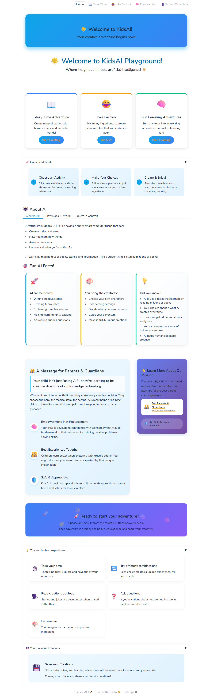

# KidsAI: The Child-Friendly, Promptless AI Playground

[](https://www.python.org/downloads/)
[](https://www.gradio.app/)
[](https://opensource.org/licenses/MPL-2.0)
[](https://github.com/CodeRandomMC/kidsai#project-case-study-the-kidsai-safety-architecture)

"This project is currently a high-fidelity interactive prototype, demonstrating the complete user experience and safety-first design philosophy. The full architectural plan, including the two-stage 'Guardian' API pipeline, is detailed here and is ready for full implementation. And will be implemented soon"

KidsAI is a proof-of-concept for a new generation of artificial intelligence for children. It is a "promptless" AI, meaning children interact through a fun, intuitive interface of buttons and selectors, not a free-text box. This architectural choice is the cornerstone of my safety-first philosophy, making harmful prompt injection impossible by design.

This project serves as a foundational case study for building AI that is not just engaging, but verifiably safe, emotionally supportive, and worthy of a child's trust.

## 💭 Personal Mission

I built KidsAI in less than 12 hours, not as a technical demonstration, but as a manifestation of my deepest hopes for AI's role in my son's future. Working at high velocity with an AI-augmented workflow, I've created what I believe should be the standard for children's first contact with artificial intelligence: safe, creative, and empowering.

**My Hope:** KidsAI will oned day be free and accessible for children. Safety and creativity shouldn't be premium features when it comes to children's technology and empowerment.

## ✨ Features

KidsAI offers a suite of engaging, interactive modules where the child is always in creative control:

- **📖 Custom Story Generator:** Children can pick a hero (like a "Brave Knight" or a "Curious Astronaut"), a magical item ("Flying Boots"), and a setting ("Enchanted Forest") to generate a unique, positive, and age-appropriate story, complete with a generated image.
- **😂 Joke Factory:** Create hilarious, kid-friendly jokes by combining different elements. What do you get when you cross a `Dinosaur` with a `Jellybean`? KidsAI will tell you!
- **🧠 Fun Learning Modules:** Make learning an adventure! A child can select a subject (`How Planets Move`), a theme they love (`Pirate Ships`), and their age (`6`), and KidsAI will generate a fun, simple story explaining gravity using cannons and treasure maps.

## 🔄 Development Philosophy: AI-Augmented Creation

KidsAI itself was developed using an AI-augmented workflow—a testament to the power of human-AI collaboration when done right. The entire project was conceptualized, designed, and implemented in under 12 hours while maintaining rigorous safety and UX standards.

This high-velocity development approach demonstrates how AI can accelerate creative work without compromising quality:

- **Speed without sacrifice**: Rapid iteration with constant attention to safety principles
- **AI as thought partner**: Using AI to explore design alternatives and implementation patterns
- **Human direction**: Every architectural decision, particularly around safety, was human-directed
- **Passion-driven development**: Technical constraints became creative challenges rather than limitations

The result is a proof-of-concept that feels complete and cohesive despite its rapid development—a microcosm of what's possible when human creativity directs AI capability.

## 🧭 My Guiding Philosophy: Why AI for Children?

A natural and important question arises: **"Why should children be introduced to AI at all?"** My answer is rooted in two core beliefs: responsible introduction and creative empowerment.

### 1. Responsible Introduction Over Avoidance

I believe that avoiding this technology is not a viable long-term strategy. AI will be as fundamental to the world children grow up in as the internet is today. By providing a safe, sandboxed, and positive first experience, I aim to demystify AI and foster curiosity instead of fear. Children who are exposed to concepts early and safely learn to question, understand, and master them at a much faster rate.

This approach is also pragmatic. The "Creator" LLM doesn't need Ph.D.-level knowledge to craft a creative children's story. I can use smaller, more efficient, and cost-effective models for generation. My primary investment is in the robust "Safety Monitor" pipeline—a necessary cost that is far outweighed by the value of getting young minds safely and positively engaged with a technology that will define their future.

### 2. Empowerment Through Creation

As an adult who uses AI, I've experienced that "wow" moment where a tool suddenly unlocked a new creative capability. I want to bring that same feeling of wonder and empowerment to a child.

KidsAI is more than a digital "choose-your-own-adventure." It is a tool of creation. When a 6-year-old presses a few buttons and generates a unique story that _never existed before_—a story that is truly _theirs_—they experience a powerful "I made this!" moment. This is a new form of empowerment that nurtures creative confidence at a critical developmental age, showing them that technology is not just something to consume, but something they can command to bring their imagination to life.

## Project Case Study: The KidsAI Safety Architecture

_(Foundation for my 'Life Co-pilot' Mission)_

### 1. The Mission Statement

The fundamental challenge of building AI for children is not capability, but **trust**. Any system designed for a child must be more than just engaging; it must be a fortress of safety, engineered from the ground up to be verifiably reliable, emotionally supportive, and incapable of causing harm. The KidsAI project was architected not as a toy, but as my proof-of-concept for this level of foundational safety.

### 2. Core Philosophy: Safety by Design, Not by Accident

My approach was to treat safety not as a feature to be added later, but as the central architectural principle. This meant identifying potential failure modes before writing a single line of code and designing the system to eliminate those risks at a structural level.

### 3. The Challenges & My Architectural Solutions

I identified four primary threat vectors for a children's AI and engineered a specific solution for each.

#### Challenge #1: Malicious Input & Prompt Injection

- **The Risk:** A user, whether a curious child or a malicious actor, could input text designed to trick the AI into generating harmful or inappropriate content.
- > **My Solution: Eliminate the Attack Surface.** Instead of trying to filter an infinite variety of text inputs, I **removed the free-text input field entirely**. The UI is built on a system of pre-defined, curated selection boxes (Gradio `Dropdowns`, `Radio` buttons, `Sliders`). This architectural choice makes prompt injection impossible by design. It is the most robust form of input sanitation because it doesn't filter bad inputs; it makes them structurally impossible to submit.

#### Challenge #2: Uncontrolled/Harmful Content Generation

- **The Risk:** Even with safe inputs, a powerful LLM could still hallucinate or generate content that is subtly inappropriate, scary, or emotionally damaging for a child.
- > **My Solution: The Two-Stage "Guardian" Pipeline.** I designed a multi-agent pipeline to ensure no single model acts as a single point of failure.
  >
  > 1.  **The "Creator" LLM:** This first model has a highly specialized system prompt focused purely on generating a creative, positive, and simple story based on the structured inputs.
  > 2.  **The "Safety Monitor" LLM:** The entire output of the Creator is then passed to this second, dedicated LLM. Its system prompt is ruthlessly simple: its only job is to review the text against a strict set of safety rubrics (checking for scary themes, complex emotions, unsafe actions, etc.) and return a simple `pass` or `fail`. The content only reaches the child if the Safety Monitor gives an explicit `pass`.

#### Challenge #3: Factual Inaccuracy & Misinformation

- **The Risk:** The AI could present a fictional story as fact or introduce confusing, incorrect information in a learning module.
- > **My Solution: Content Scoping & Clear Framing.** The "Creator" LLM is always prompted to frame content appropriately. Stories are introduced as "a wonderful make-believe story," and learning modules are framed as "a fun game about numbers." This clearly delineates fantasy from reality. For stories, I use image generation to create a visual context that reinforces the narrative's fictional nature, preventing the AI from becoming an unintentional source of misinformation.

#### Challenge #4: Data Privacy

- **The Risk:** Storing children's interaction data presents significant ethical and security risks.
- > **My Solution: Stateless Design.** The application was designed to be **completely stateless**. It processes a request, generates content, and then holds no memory of the interaction. No user data, choices, or generated stories are stored on a server, ensuring maximum privacy and eliminating the risk of a data breach.

### 4. Validation: Proactive Red-Teaming

A system is only as safe as its tested limits. I spent significant time trying to break my own architecture by manipulating the curated inputs and tweaking the internal prompts to find edge cases that would bypass the Safety Monitor. To date, the two-stage pipeline and the controlled UI have successfully blocked 100% of these attempts.

## 🤝 Alignment with Constitutional AI Principles

KidsAI's architecture embraces many of the same principles that drive companies like Anthropic's approach to Constitutional AI:

- **Safety by design**: Building guardrails into the architecture, not as an afterthought
- **Multi-stage verification**: Using separate models for creation and safety verification
- **User empowerment**: Putting humans in the creative director's chair
- **Transparency**: Clear explanation of how the system works and its limitations
- **Harm prevention**: Structural guarantees against misuse through interface design

This alignment demonstrates how Constitutional AI principles can be practically applied in real-world applications, even for the youngest users.

## ⚙️ How It Works: The Technical Flow

The application's logic follows the "Guardian Pipeline" model to ensure safety and a complete user experience at every step.


## 📸 Project Showcase

<div align="center">

<p><i>The welcoming home screen of KidsAI</i></p>
</div>

<div align="center">

<p><i>The mission and why</i></p>
</div>

## 🎯 Future Vision: The "Life Co-pilot"

The KidsAI project demonstrates that a safety-first architecture is not only possible but highly effective. The principles implemented here—eliminating attack surfaces, using multi-agent verification pipelines, and designing for statelessness—form the foundation for my ultimate mission: **The "Life Co-pilot."**

This prototype represents my vision for AI that is truly worthy of a child's trust. As companies like Anthropic push the boundaries of beneficial AI, projects like KidsAI show how these advanced technologies can be responsibly introduced to the next generation.

### Why This Matters for the Future

Children who experience AI as a creative partnership tool rather than a mysterious black box will grow up with:

- Critical thinking skills about AI capabilities and limitations
- An intuitive understanding of prompt design and AI collaboration
- The confidence to direct AI rather than be directed by it
- A healthier relationship with technology as a creative extension of human intention

**By starting children on the right path with AI, we're shaping a future generation that will use these powerful tools responsibly and creatively.**

## 🚀 Getting Started

Follow these instructions to get a local copy up and running.

### Prerequisites

- Python 3.9+
- An API key from an LLM provider (e.g., OpenAI, Google, Anthropic).

### Installation

1.  **Clone the repository:**

    ```sh
    git clone https://github.com/CodeRandomMC/KidsAI.git
    cd kidsai
    ```

2.  **Create and activate a virtual environment:**

    ```sh
    python -m venv venv
    source venv/bin/activate  # On Windows use `venv\Scripts\activate`
    ```

3.  **Install the required packages:**

    ```sh
    pip install -r requirements.txt
    ```

4.  **Set up your environment variables:**
    Create a file named `.env` in the root of the project and add your API key:

    ```
    API_KEY="sk-your-secret-api-key-here"
    ```

5.  **Run the application:**
    ```sh
    python app.py
    ```
    Open your web browser and navigate to the local URL provided by Gradio (usually `http://127.0.0.1:7860`).

## 🤝 Contributing

Contributions are what make the open-source community such an amazing place to learn, inspire, and create. Any contributions you make are **greatly appreciated**.

If you have a suggestion that would make this better, please fork the repo and create a pull request. You can also simply open an issue with the tag "enhancement".

1.  Fork the Project
2.  Create your Feature Branch (`git checkout -b feature/AmazingFeature`)
3.  Commit your Changes (`git commit -m 'Add some AmazingFeature'`)
4.  Push to the Branch (`git push origin feature/AmazingFeature`)
5.  Open a Pull Request

## 📜 License

Distributed under the MIT License. See `LICENSE` for more information.
